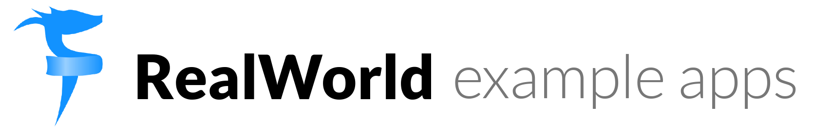

# 

> ### [Fable](https://fable.io), [Elmish](https://elmish.github.io/elmish/) and [F#](https://fsharp.org) codebase containing real world examples (CRUD, auth, advanced patterns, etc) that adheres to the [RealWorld](https://github.com/gothinkster/realworld) spec and API.

> This is now one of my testing repositories for [Perla](https://github.com/AngelMunoz/Perla) the .NET dev server for frontend development :)

### [Demo](https://real-world-fable.netlify.com/)&nbsp;&nbsp;&nbsp;&nbsp;[RealWorld](https://github.com/gothinkster/realworld)

This codebase was created to demonstrate a fully fledged fullstack application built with **[Fable](https://fable.io), [Elmish](https://elmish.github.io/elmish/) and [F#](https://fsharp.org)** including CRUD operations, authentication, routing, pagination, and more.

We've gone to great lengths to adhere to the **[Fable](https://fable.io), [Elmish](https://elmish.github.io/elmish/) and [F#](https://fsharp.org)** community styleguides & best practices.

For more information on how to this works with other frontends/backends, head over to the [RealWorld](https://github.com/gothinkster/realworld) repo.

# How it works

> Describe the general architecture of your app here

# Getting started

## Pre-requisites

You're going to need a few things installed:

- [.Net 5/6](https://dotnet.microsoft.com/download)
- [F#](https://fsharp.org/)

## Development Build

- `dotnet tool restore`
- `dotnet perla serve

And open a browser tab on *http://localhost:7331*

## Production Build

- `dotnet perla build`

## Running the tests

Pending...
